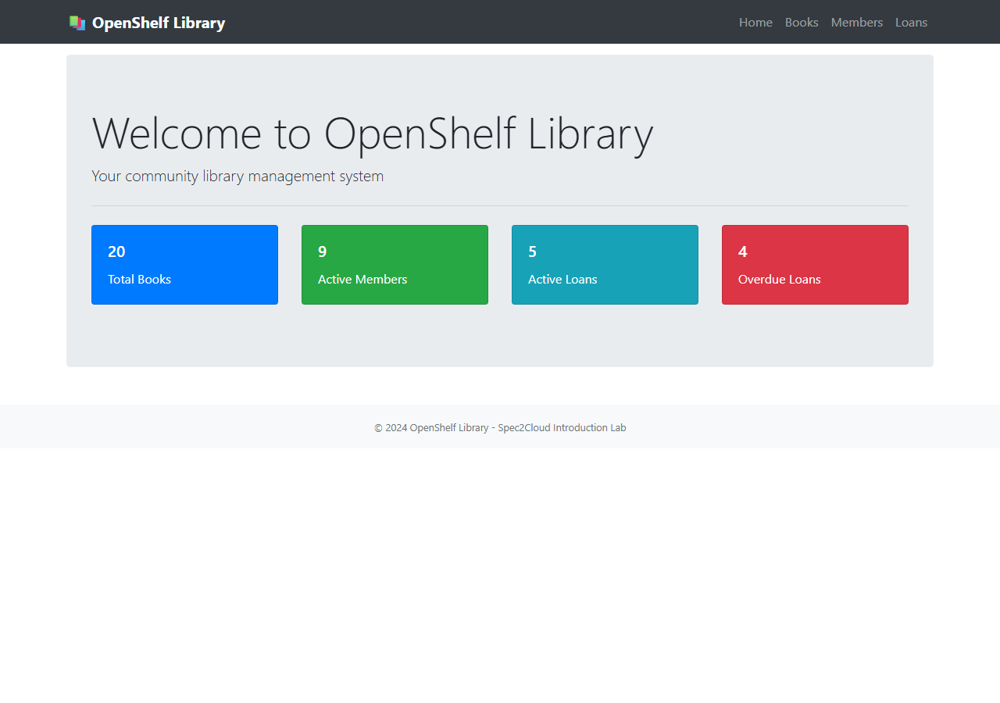
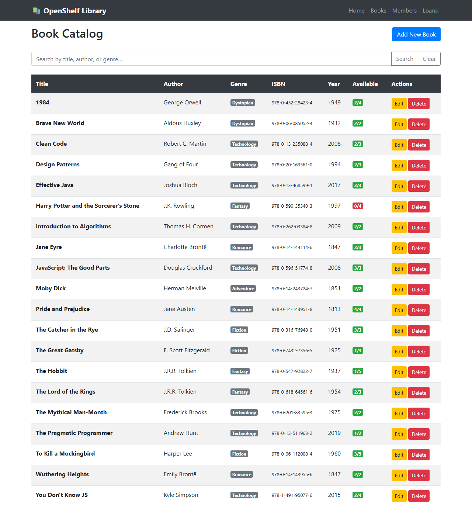
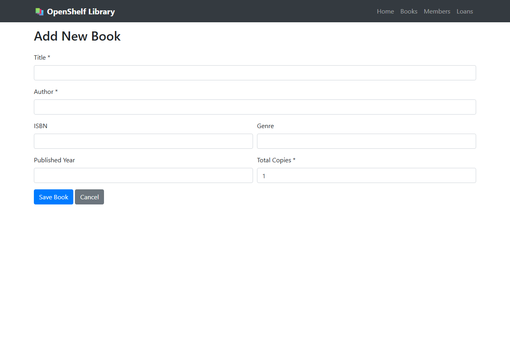
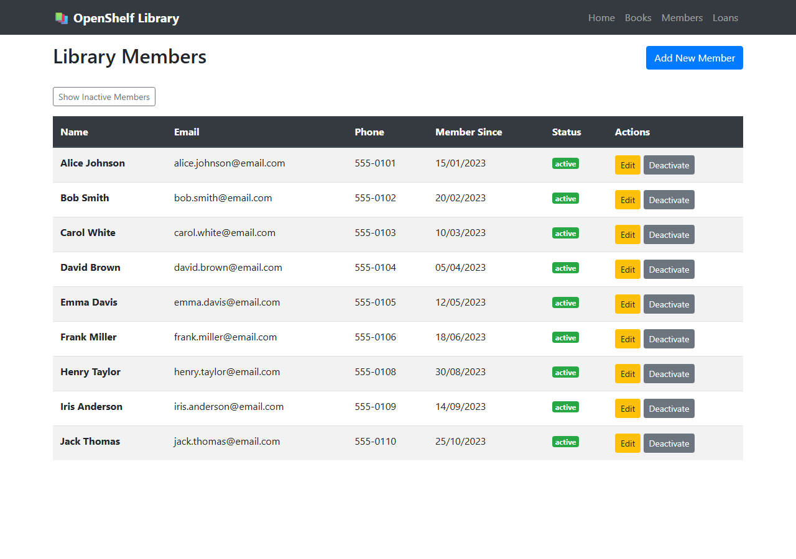
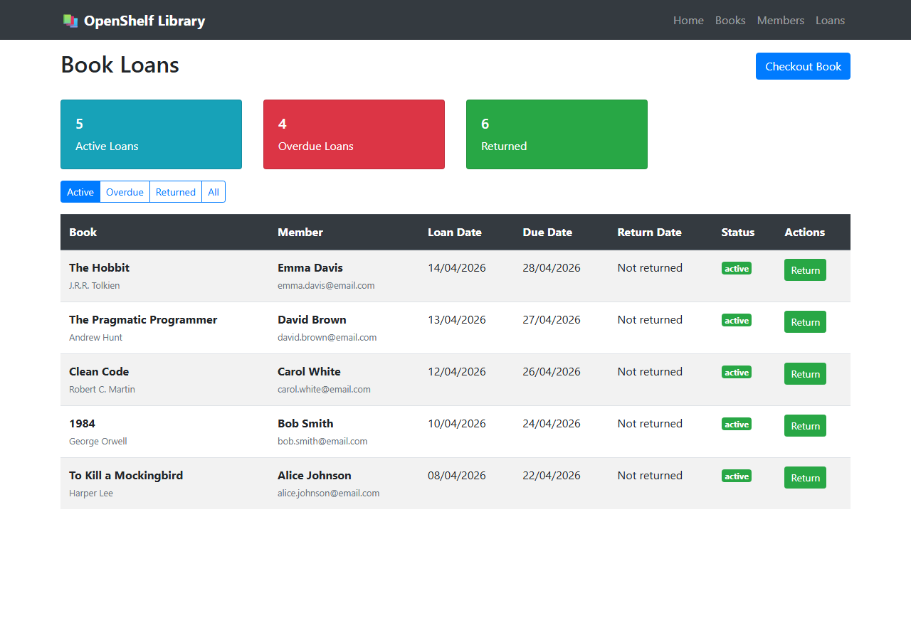
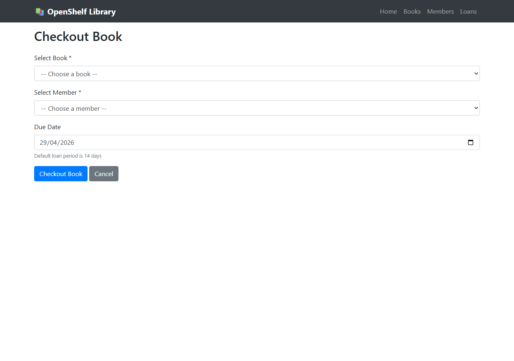

## Overview

This lab introduces spec-driven development using the OpenShelf Library application. You'll learn how to generate specifications from existing code and use them to build modern applications with Spec2Cloud.

## Understanding the Legacy Application

The OpenShelf Library is a Node.js Express application with SQLite storage, Bootstrap UI, and EJS templates. Below is what the legacy application looks like when running (`npm start` on port 3000).

The homepage serves as the main entry point to the library system:

### Book Management

The book catalog displays all books in the library with search and filter capabilities:

New books can be added through a structured form with fields for title, author, ISBN, and category:

### Member & Loan Management

The members list shows all registered library members and their borrowing status:

The loans overview tracks all active and historical book loans across the library:

The checkout form handles the book lending process, linking a member to a book:

## Screenshots Reference

| Screenshot | Description |
|---|---|
|  | Library homepage |
|  | Book catalog listing |
|  | New book entry form |
|  | Library members list |
|  | Book loans tracking |
|  | Book checkout form |
