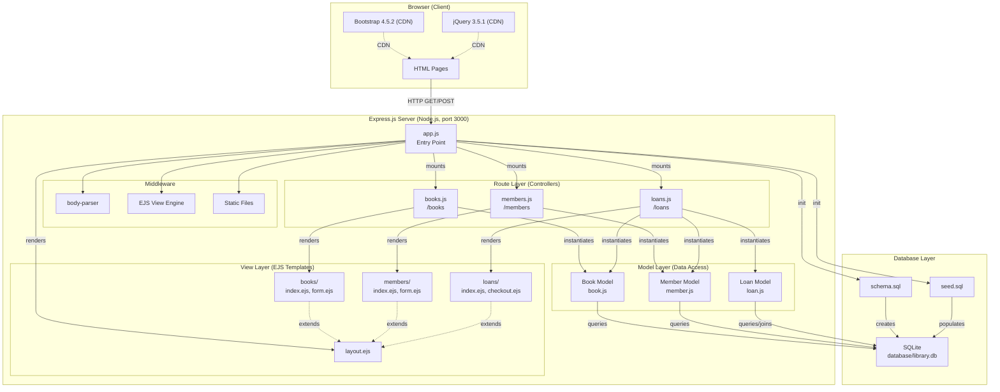
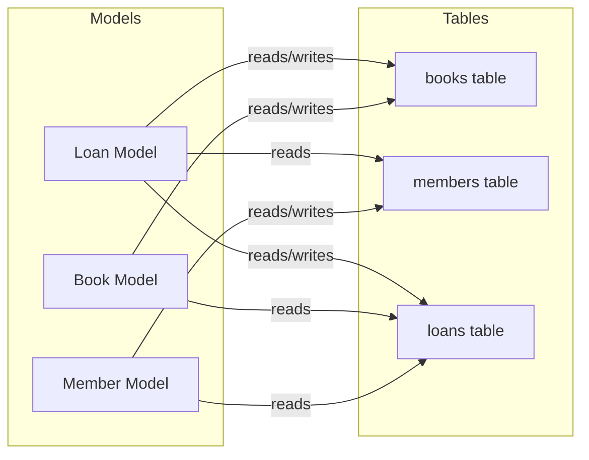
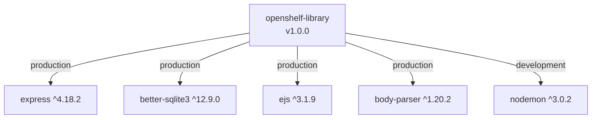
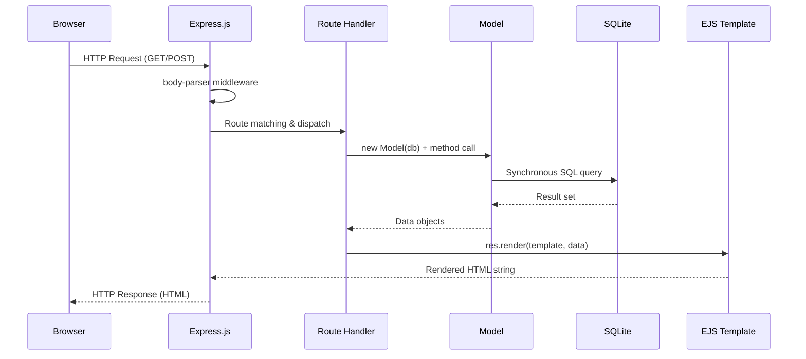
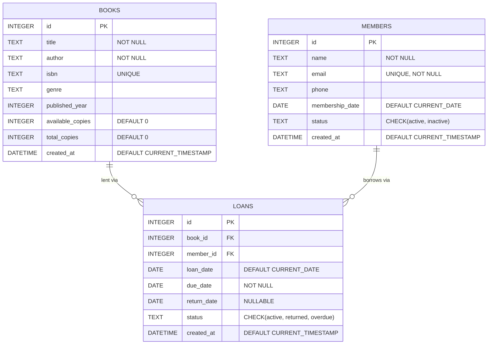

# System Architecture Overview — OpenShelf Library

> **Generated:** 2026-04-16
> **Source Version:** 1.0.0
> **Methodology:** Spec2Cloud — Extract specifications from legacy code to drive cloud-native modernization

---

## Modernization Annotations

| Property | Value |
|---|---|
| **Target Framework** | Fastify |
| **Target Database** | PostgreSQL |
| **Overall Migration Complexity** | 🟡 Medium |
| **Migration Order** | This document covers the full system; see per-component breakdown below |

### Component Migration Summary

| Component | Current | Target | Complexity | Migration Order |
|---|---|---|---|---|
| Database engine | SQLite (embedded file) | PostgreSQL (Azure Flexible Server) | 🟢 Low | 1 — Schema migration |
| Data access layer | `better-sqlite3` (sync) | `pg` Pool (async) | 🟠 Medium-High | 2 — Model rewrite |
| Web framework | Express 4.x | Fastify 5.x | 🟡 Medium | 3 — Framework swap |
| API layer | HTML (EJS templates) | JSON REST API | 🟡 Medium | 4 — API modernization |
| Configuration | Hardcoded values | Environment variables + `@fastify/env` | 🟢 Low | 5 — Config & logging |
| Logging | `console.log` | Pino (built into Fastify) | 🟢 Low | 5 — Config & logging |
| Testing | None | Jest/Vitest + Supertest | 🟡 Medium | 6 — Test suite |
| Deployment | Bare Node.js process | Docker + Azure App Service | 🟢 Low | 7 — Cloud deployment |

---

## Table of Contents

1. [Executive Summary](#1-executive-summary)
2. [System Components](#2-system-components)
3. [Component Interactions](#3-component-interactions)
4. [Technology Stack](#4-technology-stack)
5. [Deployment Model](#5-deployment-model)
6. [Component Dependency Diagram](#6-component-dependency-diagram)
7. [Request Lifecycle](#7-request-lifecycle)
8. [Data Architecture](#8-data-architecture)
9. [Architectural Characteristics](#9-architectural-characteristics)
10. [Modernization Considerations](#10-modernization-considerations)

---

## 1. Executive Summary

**OpenShelf Library** is a monolithic, server-rendered web application for community library management. It provides a book catalog, member registration, and loan tracking through a browser-based UI. The application follows a classic **Model-View-Controller (MVC)** pattern built on Node.js/Express with EJS templates and an embedded SQLite database.

| Metric | Value |
|---|---|
| Source files | 13 (3 models, 3 route modules, 6 views, 1 entry point) |
| Database tables | 3 (`books`, `members`, `loans`) |
| HTTP endpoints | 16 routes across 4 mount points |
| Runtime dependencies | 4 packages |
| Architecture style | Single-process monolith, server-side rendered MVC |

---

## 2. System Components

### 2.1 Entry Point — Application Server

| Property | Value |
|---|---|
| File | `src/app.js` |
| Responsibility | Process bootstrap, database initialization, middleware registration, route mounting, home dashboard |

The entry point performs the following on startup:

1. Creates the Express application and binds it to **port 3000** (hardcoded).
2. Initializes the SQLite database — creates the file, runs `schema.sql`, and seeds with `seed.sql` if `library.db` does not exist.
3. Stores the `db` handle on `app.locals.db` so all route handlers can access it.
4. Registers middleware: `body-parser` (URL-encoded + JSON), EJS view engine, static file serving.
5. Mounts the three domain routers under `/books`, `/members`, and `/loans`.
6. Defines the home route (`GET /`) inline, which queries aggregate statistics.
7. Registers a `SIGINT` handler for graceful database shutdown.

### 2.2 Route Layer (Controllers)

Each route module is an Express `Router` that handles HTTP requests, delegates to models, and renders views.

| Module | Mount Point | Endpoints | Responsibility |
|---|---|---|---|
| `src/routes/books.js` | `/books` | 6 | Book CRUD — list, search, add, edit, delete |
| `src/routes/members.js` | `/members` | 7 | Member CRUD — list, add, edit, deactivate, delete |
| `src/routes/loans.js` | `/loans` | 4 | Loan lifecycle — list, filter, checkout, return |
| `src/app.js` (inline) | `/` | 1 | Home dashboard with aggregate statistics |

**Route Summary:**

| Method | Path | Handler | Description |
|---|---|---|---|
| GET | `/` | `app.js` | Home dashboard with stats cards |
| GET | `/books` | `books.js` | List books; optional `?search=` query |
| GET | `/books/new` | `books.js` | Render add-book form |
| GET | `/books/:id/edit` | `books.js` | Render edit-book form |
| POST | `/books` | `books.js` | Create a new book |
| POST | `/books/:id` | `books.js` | Update an existing book |
| POST | `/books/:id/delete` | `books.js` | Delete a book (with loan guard) |
| GET | `/members` | `members.js` | List members; optional `?include_inactive=true` |
| GET | `/members/new` | `members.js` | Render add-member form |
| GET | `/members/:id/edit` | `members.js` | Render edit-member form |
| POST | `/members` | `members.js` | Create a new member |
| POST | `/members/:id` | `members.js` | Update an existing member |
| POST | `/members/:id/deactivate` | `members.js` | Soft-deactivate (with loan guard) |
| POST | `/members/:id/delete` | `members.js` | Hard-delete (with history guard) |
| GET | `/loans` | `loans.js` | List loans; `?filter=` for status; auto-marks overdue |
| GET | `/loans/checkout` | `loans.js` | Render checkout form (available books + active members) |
| POST | `/loans/checkout` | `loans.js` | Create a loan (availability check, decrement copies) |
| POST | `/loans/:id/return` | `loans.js` | Return a book (increment copies) |

### 2.3 Model Layer (Data Access + Business Logic)

Models are ES6 classes that receive a `better-sqlite3` database handle via constructor injection. They encapsulate all SQL queries and enforce business rules.

#### Book Model (`src/models/book.js`)

| Method | Signature | Description |
|---|---|---|
| `findAll` | `(search?: string)` | List all books; optional LIKE search across title, author, genre |
| `findById` | `(id: number)` | Retrieve a single book by primary key |
| `create` | `(book: object)` | Insert a new book; sets `available_copies = total_copies` |
| `update` | `(id, book)` | Update book; recalculates `available_copies` based on `total_copies` diff |
| `delete` | `(id: number)` | Delete with guard — rejects if book has active loans |
| `decrementAvailable` | `(id: number)` | Decrease `available_copies` by 1 (used during checkout) |
| `incrementAvailable` | `(id: number)` | Increase `available_copies` by 1 (used during return) |

#### Member Model (`src/models/member.js`)

| Method | Signature | Description |
|---|---|---|
| `findAll` | `(includeInactive?: boolean)` | List members; defaults to active-only |
| `findById` | `(id: number)` | Retrieve a single member by primary key |
| `create` | `(member: object)` | Insert with defaults for `membership_date` and `status` |
| `update` | `(id, member)` | Update name, email, phone, status |
| `deactivate` | `(id: number)` | Soft-delete — sets status to `'inactive'`; guard for active loans |
| `delete` | `(id: number)` | Hard-delete — guard rejects if any loan history exists |

#### Loan Model (`src/models/loan.js`)

| Method | Signature | Description |
|---|---|---|
| `findAll` | `(status?: string)` | List loans with joined book/member data; optional status filter |
| `findById` | `(id: number)` | Single loan lookup with book + member joins |
| `findActiveByMember` | `(memberId: number)` | Active loans for a specific member |
| `create` | `(loan: object)` | Checkout flow — checks book availability, inserts loan, decrements copies |
| `returnBook` | `(id: number)` | Return flow — validates loan status, sets return date, increments copies |
| `updateOverdueStatus` | `()` | Batch-update: marks active loans past due date as `'overdue'` |
| `calculateDueDate` | `(days?: number)` | Utility — computes ISO date string `days` in the future (default: 14) |
| `getStatistics` | `()` | Returns counts of active, overdue, and returned loans |

### 2.4 View Layer (EJS Templates)

| Template | Path | Purpose |
|---|---|---|
| Layout | `src/views/layout.ejs` | Shared HTML shell — navbar, Bootstrap CDN, footer |
| Book Index | `src/views/books/index.ejs` | Book catalog table with search bar, edit/delete actions |
| Book Form | `src/views/books/form.ejs` | Reusable add/edit form for books |
| Member Index | `src/views/members/index.ejs` | Member list with active/inactive toggle |
| Member Form | `src/views/members/form.ejs` | Reusable add/edit form for members |
| Loan Index | `src/views/loans/index.ejs` | Loan list with stats cards and status filter tabs |
| Loan Checkout | `src/views/loans/checkout.ejs` | Checkout form with book/member dropdown selectors |

### 2.5 Database Layer

| Artifact | Path | Purpose |
|---|---|---|
| Schema DDL | `database/schema.sql` | Table definitions, constraints, indexes |
| Seed Data | `database/seed.sql` | 20 books, 10 members, 15 loans for development |
| Database File | `database/library.db` | SQLite file — auto-created at startup if absent |

---

## 3. Component Interactions

### 3.1 Interaction Model

All components communicate **in-process** via synchronous function calls. There are no network boundaries, message queues, or external service calls within the server.

```
Browser ──HTTP──▶ Express Middleware ──▶ Route Handler ──▶ Model ──▶ SQLite
                                              │
                                              ▼
                                         EJS Template ──HTML──▶ Browser
```

### 3.2 Key Interaction Flows

#### Book Checkout (Loan Creation)

```
loans.js POST /loans/checkout
  │
  ├─▶ Loan.create(loan)
  │     ├─▶ SELECT book WHERE id = ? (availability check)
  │     ├─▶ INSERT INTO loans (...)
  │     └─▶ UPDATE books SET available_copies = available_copies - 1
  │
  └─▶ res.redirect('/loans')
```

#### Book Return

```
loans.js POST /loans/:id/return
  │
  ├─▶ Loan.returnBook(id)
  │     ├─▶ Loan.findById(id)   (validates loan exists & is not already returned)
  │     ├─▶ UPDATE loans SET return_date = ?, status = 'returned'
  │     └─▶ UPDATE books SET available_copies = available_copies + 1
  │
  └─▶ res.redirect('/loans')
```

#### Overdue Detection

```
loans.js GET /loans
  │
  ├─▶ Loan.updateOverdueStatus()
  │     └─▶ UPDATE loans SET status = 'overdue' WHERE status = 'active' AND due_date < today
  │
  ├─▶ Loan.findAll(filter)
  ├─▶ Loan.getStatistics()
  └─▶ res.render('loans/index', { loans, filter, stats })
```

### 3.3 Cross-Model Dependencies

The **Loan** model has implicit dependencies on both the **Book** and **Member** models via foreign key joins and copy-count mutations:

- `Loan.create()` reads from `books` and writes to `books` (decrement available copies).
- `Loan.returnBook()` writes to `books` (increment available copies).
- `Loan.findAll()` and `Loan.findById()` join across `books` and `members`.
- `Book.delete()` checks `loans` table for active loans.
- `Member.deactivate()` and `Member.delete()` check `loans` table.

---

## 4. Technology Stack

### 4.1 Runtime & Framework

| Layer | Technology | Version | Notes |
|---|---|---|---|
| Runtime | Node.js | Not pinned | No `.nvmrc` or `engines` field in `package.json` |
| Web framework | Express.js | ^4.18.2 | Handles routing, middleware pipeline, static files |
| Template engine | EJS | ^3.1.9 | Server-side HTML rendering with embedded JavaScript |
| Database driver | better-sqlite3 | ^12.9.0 | Synchronous SQLite3 bindings for Node.js |
| Body parsing | body-parser | ^1.20.2 | URL-encoded and JSON request body parsing |

### 4.2 Client-Side Libraries (CDN)

| Library | Version | Source | Purpose |
|---|---|---|---|
| Bootstrap | 4.5.2 | stackpath CDN | Responsive CSS framework, grid, components |
| jQuery | 3.5.1 | jquery CDN | DOM manipulation (Bootstrap dependency) |
| Bootstrap JS | 4.5.2 | jsdelivr CDN | Interactive Bootstrap components (modals, collapse) |

### 4.3 Development Tooling

| Tool | Version | Purpose |
|---|---|---|
| nodemon | ^3.0.2 (devDependency) | Auto-restarts the server on file changes during development |

### 4.4 Database

| Property | Value |
|---|---|
| Engine | SQLite 3 (embedded) |
| Driver | better-sqlite3 (synchronous, in-process) |
| File location | `database/library.db` |
| Schema management | Manual DDL in `database/schema.sql` — no migration framework |
| Tables | `books`, `members`, `loans` |
| Indexes | `idx_loans_status`, `idx_loans_due_date`, `idx_books_genre` |
| Constraints | Foreign keys (`loans → books`, `loans → members`), UNIQUE (`isbn`, `email`), CHECK (`status` enums) |

---

## 5. Deployment Model

### 5.1 Current Deployment

The application runs as a **single Node.js process** with an embedded SQLite database on the local filesystem. There is no containerization, orchestration, or cloud deployment configuration.

```
┌──────────────────────────────────────────┐
│              Host Machine                │
│                                          │
│  ┌────────────────────────────────────┐  │
│  │     Node.js Process (port 3000)    │  │
│  │                                    │  │
│  │  Express.js + EJS + better-sqlite3 │  │
│  │                                    │  │
│  └───────────────┬────────────────────┘  │
│                  │ file I/O               │
│  ┌───────────────▼────────────────────┐  │
│  │  database/library.db (SQLite)      │  │
│  └────────────────────────────────────┘  │
│                                          │
└──────────────────────────────────────────┘
```

**Characteristics:**

- **No Dockerfile or container configuration** — runs directly on the host.
- **No reverse proxy** — Express serves directly on port 3000.
- **No environment variables** — port and database path are hardcoded.
- **No health checks** — no `/health` or `/ready` endpoints.
- **No logging framework** — uses `console.log` only.
- **No HTTPS** — serves plain HTTP.
- **Stateful file-based storage** — the SQLite file is tightly coupled to the host filesystem.

### 5.2 Startup Sequence

```
1. node src/app.js
2. Check if database/library.db exists
   ├── NO  → Create DB, execute schema.sql, execute seed.sql
   └── YES → Open existing DB
3. Register middleware (body-parser, EJS, static files)
4. Mount route handlers
5. Listen on port 3000
6. Log: "OpenShelf Library running at http://localhost:3000"
```

### 5.3 Shutdown Behavior

- The application listens for `SIGINT` (Ctrl+C) and closes the database handle before exiting.
- No drain period for in-flight requests.
- No `SIGTERM` handler (relevant for container orchestrators).

### 5.4 Target Modernization Platform

Per `spec2cloud.config.json`, the modernization target is **Azure App Service**:

| Property | Target |
|---|---|
| Cloud provider | Microsoft Azure |
| Compute service | Azure App Service |
| Target directory | `modern/` |

---

## 6. Component Dependency Diagram

### 6.1 Full System Architecture



### 6.2 Model-Level Dependencies



### 6.3 Package Dependency Graph



---

## 7. Request Lifecycle

### 7.1 General Flow



### 7.2 Step-by-Step

1. **Browser** sends an HTTP request (GET for pages, POST for form submissions) to port 3000.
2. **Express middleware** pipeline runs: `body-parser` parses the request body (URL-encoded or JSON).
3. **Route matching** dispatches to the correct handler based on method and path.
4. **Route handler** instantiates the relevant Model class, passing `req.app.locals.db`.
5. **Model** executes one or more synchronous SQL statements via `better-sqlite3`.
6. **Route handler** passes the result data to an EJS template via `res.render()`.
7. **EJS** renders the template to an HTML string using the shared `layout.ejs`.
8. **Express** sends the rendered HTML back to the browser.
9. For POST operations, the handler typically issues a `res.redirect()` (POST-Redirect-GET pattern).

---

## 8. Data Architecture

### 8.1 Entity-Relationship Diagram



### 8.2 Database Indexes

| Index | Table | Column(s) | Purpose |
|---|---|---|---|
| `idx_loans_status` | `loans` | `status` | Fast filtering by loan status |
| `idx_loans_due_date` | `loans` | `due_date` | Overdue detection queries |
| `idx_books_genre` | `books` | `genre` | Genre-based book filtering |

---

## 9. Architectural Characteristics

| Characteristic | Assessment |
|---|---|
| **Architecture style** | Single-process monolith with MVC layering |
| **Coupling** | Tightly coupled — all components share a single process and database handle |
| **I/O model** | Synchronous — `better-sqlite3` blocks the event loop during queries |
| **Scalability** | Vertical only — no clustering, no horizontal scaling, no connection pooling |
| **State management** | Stateful — SQLite file on local filesystem; no external state store |
| **Authentication** | None — all endpoints are publicly accessible |
| **Authorization** | None — no role-based or resource-level access control |
| **API style** | Server-rendered HTML (not RESTful JSON); form-based POST with redirects |
| **Error handling** | Basic try/catch in routes; returns plain-text error messages (HTTP 400/404) |
| **Logging** | `console.log` only — no structured logging, no log levels |
| **Testing** | None — no test framework, no test files |
| **Configuration** | Hardcoded values (port 3000, database path) — no environment variable support |
| **Health monitoring** | None — no health check or readiness endpoints |

---

## 10. Modernization Considerations

### 10.1 Modernization Annotations

| Property | Value |
|---|---|
| **Target Framework** | Fastify |
| **Target Database** | PostgreSQL |

### 10.2 Recommended Migration Order

| Order | Phase | Complexity | Description |
|---|---|---|---|
| 1 | Database schema migration | 🟢 Low | Convert SQLite DDL to PostgreSQL; `AUTOINCREMENT` → `GENERATED ALWAYS AS IDENTITY`, `DATETIME` → `TIMESTAMPTZ` |
| 2 | Data access layer rewrite | 🟠 Medium-High | Replace sync `better-sqlite3` with async `pg` pool; rewrite all model methods |
| 3 | Framework migration | 🟡 Medium | Replace Express with Fastify; restructure to plugin architecture |
| 4 | API modernization | 🟡 Medium | Convert HTML endpoints to JSON REST API with JSON Schema validation |
| 5 | Configuration & logging | 🟢 Low | Externalize config via env vars; adopt Pino structured logging |
| 6 | Testing | 🟡 Medium | Add unit and integration tests for all models and routes |
| 7 | Cloud deployment | 🟢 Low | Dockerfile, health checks, Azure App Service configuration |

### 10.3 Strengths to Preserve

- **Clean MVC separation** — Routes, Models, and Views are well-organized in dedicated directories.
- **Simple domain model** — Three entities with clear relationships are easy to map to a modern schema.
- **Consistent patterns** — All models follow the same constructor-injection and method-naming conventions.
- **Business rule encapsulation** — Guards (e.g., loan-based delete prevention) are in the model layer, not routes.

### 10.4 Areas Requiring Modernization

| Area | Current State | Modernization Target |
|---|---|---|
| Database | Embedded SQLite file | Managed database service (e.g., Azure SQL, Azure Database for PostgreSQL) |
| API layer | HTML-only responses | RESTful JSON API (OpenAPI-defined) + separate frontend |
| Authentication | None | Identity provider integration (e.g., Microsoft Entra ID) |
| Configuration | Hardcoded | Environment variables / Azure App Configuration |
| Logging | `console.log` | Structured logging (e.g., Application Insights) |
| Testing | None | Unit, integration, and e2e test suites |
| Containerization | None | Dockerfile for consistent deployment |
| CI/CD | None | GitHub Actions pipeline |
| Health checks | None | `/health` and `/ready` endpoints |
| Static assets | CDN links in templates | Bundled or managed via CDN with SRI hashes |
