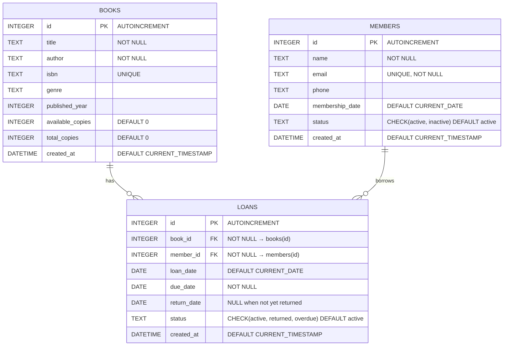

# Entity-Relationship Specification — OpenShelf Library

> Auto-generated from `database/schema.sql` and the application model layer (`src/models/`).

---

## Modernization Annotations

| Property | Value |
|---|---|
| **Target Framework** | Fastify |
| **Target Database** | PostgreSQL |
| **Migration Complexity** | 🟡 Medium |
| **Migration Order** | 1 of 7 — migrated together with entity-model as part of the database layer |

### Relationship Migration Notes

- **Foreign key enforcement:** SQLite requires `PRAGMA foreign_keys = ON` per connection. PostgreSQL enforces foreign keys by default — no pragma needed.
- **Cascade behavior:** Currently no cascade delete; enforced in application code. Add explicit `ON DELETE RESTRICT` constraints in PostgreSQL to enforce at the database level.
- **Referential checks:** Business rules (e.g., "cannot delete book with active loans") should be supplemented with PostgreSQL `CHECK` constraints or triggers for defense-in-depth.
- **Index strategy:** Existing indexes (`idx_loans_status`, `idx_loans_due_date`, `idx_books_genre`) map directly. Add a composite index on `loans(book_id, status)` for the active-loan guard queries.
- **Join performance:** PostgreSQL's query planner handles the `books ↔ loans ↔ members` joins natively; no special migration concern.

---

---

## ER Diagram

---

## Entities

### 1. `books`

Represents a physical book title held by the library. Copy counts track inventory.

| Column | Type | Constraints | Default | Description |
|---|---|---|---|---|
| `id` | INTEGER | PRIMARY KEY, AUTOINCREMENT | — | Unique book identifier |
| `title` | TEXT | NOT NULL | — | Book title |
| `author` | TEXT | NOT NULL | — | Author name |
| `isbn` | TEXT | UNIQUE | — | ISBN code (nullable for older titles) |
| `genre` | TEXT | — | — | Genre category (e.g. Fiction, Technology, Fantasy) |
| `published_year` | INTEGER | — | — | Year of first publication |
| `available_copies` | INTEGER | — | `0` | Copies currently available for checkout |
| `total_copies` | INTEGER | — | `0` | Total copies owned by the library |
| `created_at` | DATETIME | — | `CURRENT_TIMESTAMP` | Row creation timestamp |

### 2. `members`

Represents a registered library patron.

| Column | Type | Constraints | Default | Description |
|---|---|---|---|---|
| `id` | INTEGER | PRIMARY KEY, AUTOINCREMENT | — | Unique member identifier |
| `name` | TEXT | NOT NULL | — | Member full name |
| `email` | TEXT | NOT NULL, UNIQUE | — | Email address (login identifier) |
| `phone` | TEXT | — | — | Contact phone number |
| `membership_date` | DATE | — | `CURRENT_DATE` | Date of registration |
| `status` | TEXT | CHECK (`active`, `inactive`) | `'active'` | Account status |
| `created_at` | DATETIME | — | `CURRENT_TIMESTAMP` | Row creation timestamp |

### 3. `loans`

Junction entity representing a single book checkout event. Links a book to a member for a time period.

| Column | Type | Constraints | Default | Description |
|---|---|---|---|---|
| `id` | INTEGER | PRIMARY KEY, AUTOINCREMENT | — | Unique loan identifier |
| `book_id` | INTEGER | NOT NULL, FK → `books(id)` | — | The borrowed book |
| `member_id` | INTEGER | NOT NULL, FK → `members(id)` | — | The borrowing member |
| `loan_date` | DATE | — | `CURRENT_DATE` | Date of checkout |
| `due_date` | DATE | NOT NULL | — | Expected return date (default: loan_date + 14 days) |
| `return_date` | DATE | — | `NULL` | Actual return date; `NULL` while book is out |
| `status` | TEXT | CHECK (`active`, `returned`, `overdue`) | `'active'` | Current loan state |
| `created_at` | DATETIME | — | `CURRENT_TIMESTAMP` | Row creation timestamp |

---

## Relationships

| Relationship | Cardinality | FK Column | Description |
|---|---|---|---|
| `books` → `loans` | One-to-Many | `loans.book_id` | A book can be loaned many times over its lifetime |
| `members` → `loans` | One-to-Many | `loans.member_id` | A member can have many concurrent and historical loans |

Both foreign keys use SQLite's `FOREIGN KEY` clause. There is no cascade delete — referential checks are enforced in application code (see *Business Rules* below).

---

## Indexes

| Index Name | Table | Column(s) | Purpose |
|---|---|---|---|
| `idx_loans_status` | `loans` | `status` | Fast filtering of active/overdue/returned loans |
| `idx_loans_due_date` | `loans` | `due_date` | Efficient overdue-detection queries |
| `idx_books_genre` | `books` | `genre` | Genre-based search and filtering |

SQLite automatically creates unique indexes on `books.isbn` and `members.email` via their `UNIQUE` constraints, plus the implicit rowid-based index on every `PRIMARY KEY`.

---

## Enumerated Values

| Entity | Column | Allowed Values | Default |
|---|---|---|---|
| `members` | `status` | `active`, `inactive` | `active` |
| `loans` | `status` | `active`, `returned`, `overdue` | `active` |

Both are enforced at the database level with `CHECK` constraints.

---

## Business Rules (Application Layer)

These rules are enforced in `src/models/` and are **not** expressed as database triggers or cascades.

| # | Rule | Enforced In |
|---|---|---|
| 1 | A book cannot be deleted while it has active loans. | `Book.delete()` |
| 2 | A member cannot be deactivated while they have active loans. | `Member.deactivate()` |
| 3 | A member cannot be deleted if they have any loan history (active or returned). | `Member.delete()` |
| 4 | A book cannot be checked out when `available_copies ≤ 0`. | `Loan.create()` |
| 5 | `available_copies` is decremented by 1 on checkout and incremented by 1 on return. | `Loan.create()`, `Loan.returnBook()` |
| 6 | When `total_copies` is updated, `available_copies` is adjusted by the delta (floored at 0). | `Book.update()` |
| 7 | On creation, `available_copies` is set equal to `total_copies`. | `Book.create()` |
| 8 | A returned loan cannot be returned again. | `Loan.returnBook()` |
| 9 | Active loans whose `due_date < today` are batch-updated to `overdue`. | `Loan.updateOverdueStatus()` |
| 10 | Default loan period is **14 days** from checkout date. | `Loan.calculateDueDate()` |

---

## Seed Data Summary

The `database/seed.sql` file populates the database with representative data:

| Entity | Count | Notes |
|---|---|---|
| Books | 20 | Mix of classic literature and technology titles across 6 genres |
| Members | 10 | 9 active, 1 inactive |
| Loans | 15 | 5 active, 4 overdue, 6 returned |
